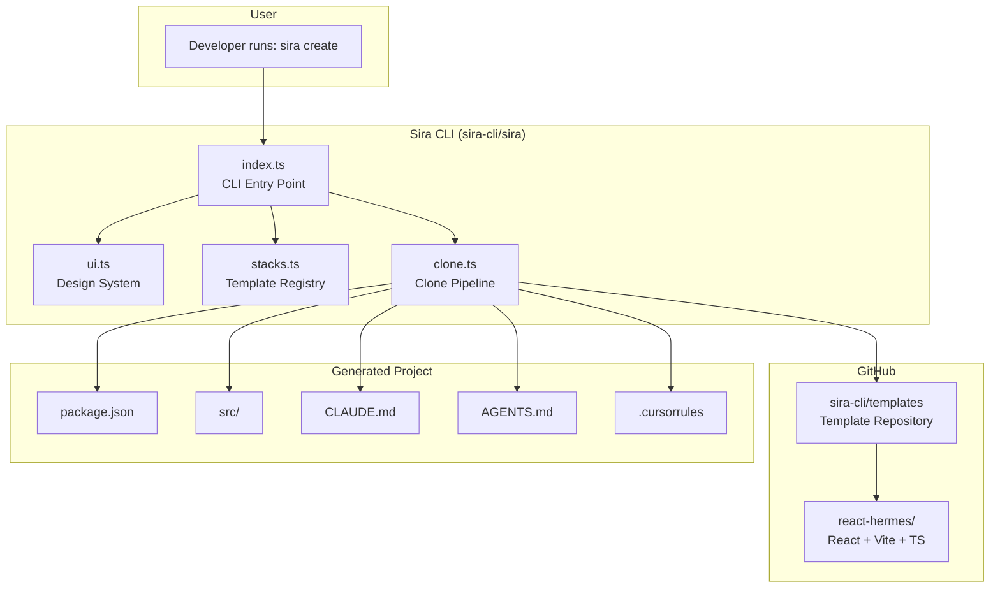
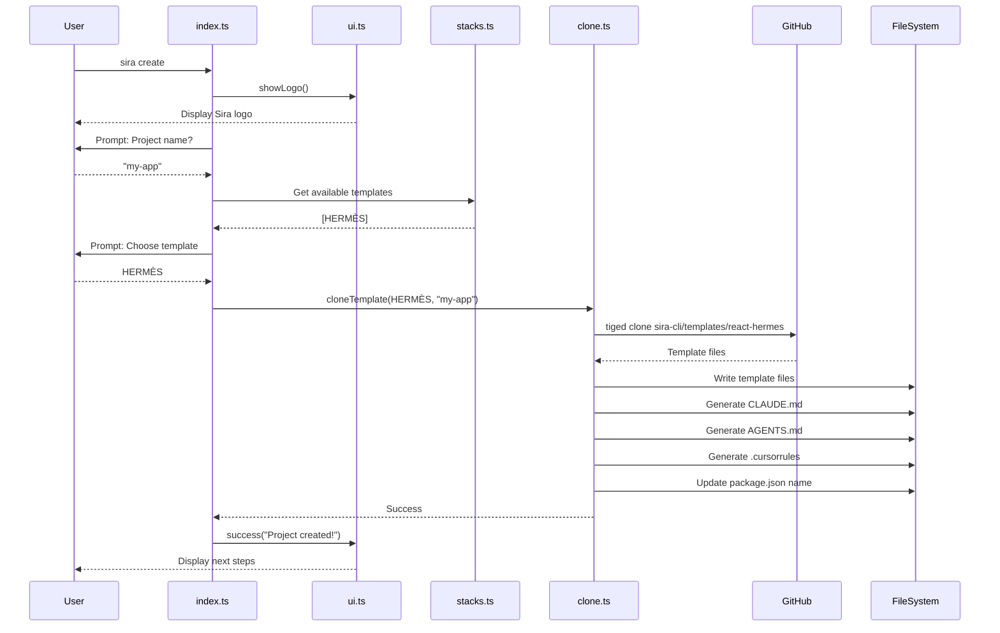
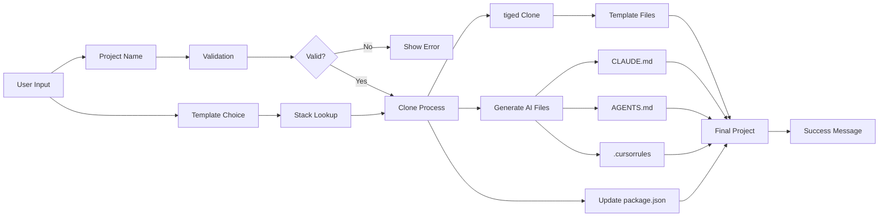
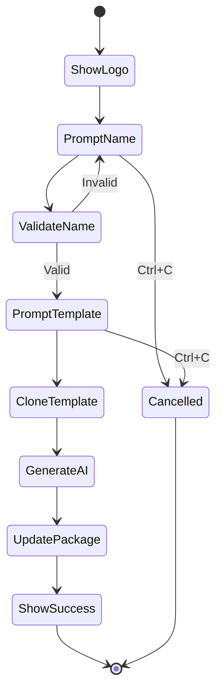
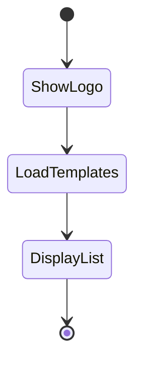
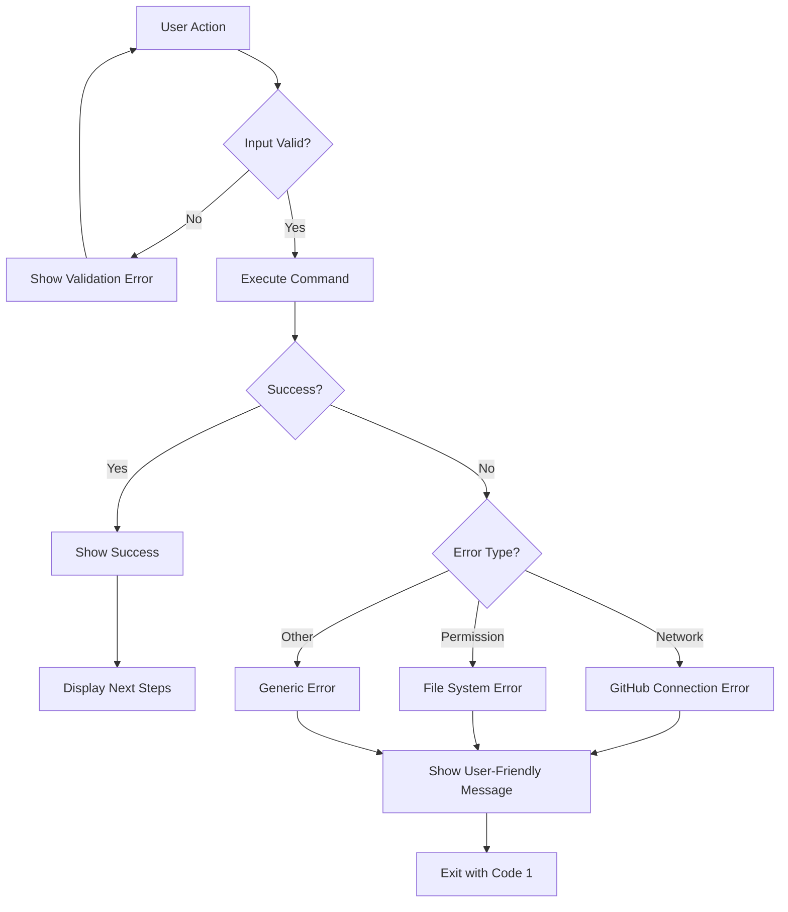
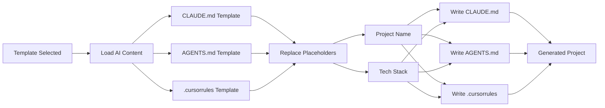
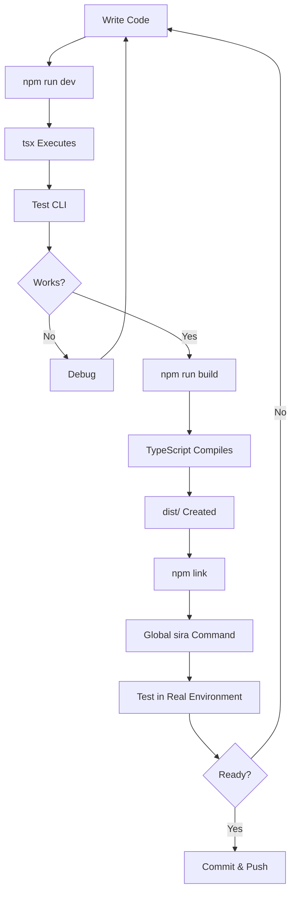

# Sira Architecture Overview

> Visual guide to understand how Sira works

---

## System Architecture



---

## CLI Flow



---

## File Structure

### Sira CLI Repository (sira-cli/sira)

```
sira/
├── src/
│   ├── index.ts          # CLI entry point
│   │   ├── main()        # Parse commands
│   │   ├── createCommand()
│   │   ├── listCommand()
│   │   └── showHelp()
│   │
│   ├── ui.ts             # Design system
│   │   ├── colors        # Color palette
│   │   ├── showLogo()    # ASCII art
│   │   └── ui object     # Helper functions
│   │
│   ├── stacks.ts         # Template registry
│   │   ├── Stack interface
│   │   └── stacks array  # [HERMÈS]
│   │
│   └── clone.ts          # Clone pipeline
│       ├── cloneTemplate()
│       ├── generateAIFiles()
│       └── updatePackageJson()
│
├── package.json          # Dependencies & scripts
├── tsconfig.json         # TypeScript config
├── PROJECT.md            # Project context
├── SPRINT_PLAN.md        # Detailed plan
├── IMPLEMENTATION_GUIDE.md
├── READY_TO_CODE.md
└── README.md             # User documentation
```

### Template Repository (sira-cli/templates)

```
templates/
└── react-hermes/         # HERMÈS template
    ├── package.json      # React + Vite + TS deps
    ├── tsconfig.json     # TS config
    ├── vite.config.ts    # Vite config
    ├── index.html        # Entry HTML
    ├── .gitignore
    ├── src/
    │   ├── main.tsx      # React entry point
    │   ├── App.tsx       # Main component
    │   ├── App.css       # Styles
    │   └── vite-env.d.ts # Vite types
    └── public/
        └── vite.svg      # Logo
```

### Generated Project Structure

```
my-app/                   # User's new project
├── package.json          # Name updated to "my-app"
├── tsconfig.json
├── vite.config.ts
├── index.html
├── .gitignore
├── src/
│   ├── main.tsx
│   ├── App.tsx
│   ├── App.css
│   └── vite-env.d.ts
├── public/
│   └── vite.svg
├── CLAUDE.md             # ✨ Generated by Sira
├── AGENTS.md             # ✨ Generated by Sira
└── .cursorrules          # ✨ Generated by Sira
```

---

## Data Flow



---

## Module Dependencies

```mermaid
graph TD
    INDEX[index.ts] --> UI[ui.ts]
    INDEX --> STACKS[stacks.ts]
    INDEX --> CLONE[clone.ts]
    
    CLONE --> STACKS
    
    UI --> PC[picocolors]
    INDEX --> CLACK[@clack/prompts]
    CLONE --> TIGED[tiged]
    CLONE --> FS[fs/promises]
    CLONE --> PATH[path]
```

---

## Tech Stack Layers

```mermaid
graph TB
    subgraph "User Interface"
        CLACK[@clack/prompts<br/>Interactive CLI]
        COLORS[picocolors<br/>Terminal colors]
    end
    
    subgraph "Core Logic"
        TS[TypeScript<br/>Type safety]
        ESM[ESM Modules<br/>Modern imports]
    end
    
    subgraph "Template Management"
        TIGED[tiged<br/>GitHub cloning]
        FS[Node.js fs<br/>File operations]
    end
    
    subgraph "Runtime"
        NODE[Node.js 24+<br/>JavaScript runtime]
    end
    
    CLACK --> TS
    COLORS --> TS
    TS --> ESM
    ESM --> TIGED
    ESM --> FS
    TIGED --> NODE
    FS --> NODE
```

---

## Command Flow

### `sira create`



### `sira list`



---

## Error Handling Strategy



---

## AI Files Generation Process



---

## Development Workflow



---

## Key Design Decisions

### Why tiged over degit?
- degit is unmaintained and incompatible with Node 24
- tiged is a maintained fork with same API
- Ensures future compatibility

### Why Pure ESM?
- Modern standard (Node 24 native)
- Better tree-shaking
- Future-proof
- Cleaner syntax

### Why @clack/prompts?
- Beautiful, consistent UI
- Easy to use high-level API
- Built-in cancellation handling
- Modern and maintained

### Why Separate Template Repo?
- Clean separation of concerns
- Easy to add new templates
- Users can fork and customize
- Better version control

### Why Generate AI Files?
- Core value proposition of Sira
- Saves developers time
- Ensures consistency
- Makes projects AI-ready from day one

---

**This architecture is designed to be simple, maintainable, and extensible.** 🚀