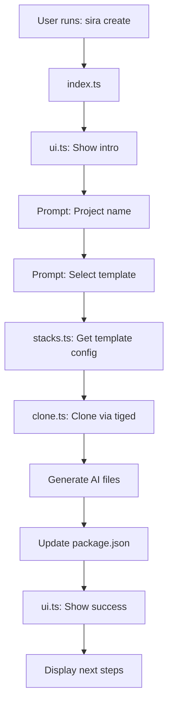

# Sprint Plan - Sira MVP (HERMÈS Template)

> Plan détaillé pour le développement du MVP de Sira avec le template HERMÈS
> Sprint: IBM Bob Hackathon (May 15-17, 2026)

---

## 🎯 Objectif du Sprint

Créer un CLI fonctionnel qui permet de scaffolder un projet React + Vite + TypeScript avec des fichiers AI contextuels pré-configurés.

**Scope MVP:**
- ✅ Un seul template: HERMÈS (React + Vite + TypeScript)
- ✅ Repository GitHub séparé pour les templates
- ✅ Template minimal (pas de routing, pas de state management)
- ✅ Fichiers AI contextuels générés automatiquement

---

## 🏗️ Architecture Technique

### Structure des Repositories

```
github.com/sira-cli/sira (CLI)
├── src/
│   ├── index.ts          # Entry point + CLI commands
│   ├── ui.ts             # Design system (@clack/core + picocolors)
│   ├── stacks.ts         # Template registry (typed)
│   └── clone.ts          # Clone pipeline (tiged)
├── package.json
├── tsconfig.json
├── PROJECT.md            # Context (existant)
└── README.md

github.com/sira-cli/templates
└── react-hermes/         # Template HERMÈS
    ├── package.json
    ├── tsconfig.json
    ├── vite.config.ts
    ├── index.html
    ├── src/
    │   ├── main.tsx
    │   ├── App.tsx
    │   └── vite-env.d.ts
    ├── CLAUDE.md         # AI context for Claude
    ├── AGENTS.md         # AI context for all agents
    └── .cursorrules      # Cursor-specific rules
```

### Tech Stack (CLI)

| Dépendance | Version | Rôle | Notes |
|------------|---------|------|-------|
| Node.js | v24+ | Runtime | Requis pour ESM natif |
| TypeScript | Latest | Language | Pure ESM, extensions `.js` |
| @clack/core | Latest | CLI prompts | Interactive UX |
| @clack/prompts | Latest | Prompt helpers | Simplification |
| picocolors | Latest | Terminal colors | Léger et rapide |
| tiged | Latest | Template cloning | Compatible Node 24 |
| tsx | Latest | Dev execution | TypeScript runner |

### Décisions Techniques Clés

#### 1. ESM Pure (Pas de CommonJS)
```typescript
// ✅ Correct
import { ui } from './ui.js';  // Extension .js obligatoire
export { createProject };

// ❌ Incorrect
const ui = require('./ui');
module.exports = { createProject };
```

#### 2. Structure des Imports
```json
// package.json
{
  "type": "module",
  "exports": {
    ".": "./dist/index.js"
  }
}
```

#### 3. TypeScript Configuration
```json
// tsconfig.json
{
  "compilerOptions": {
    "module": "ESNext",
    "moduleResolution": "bundler",
    "target": "ES2022",
    "outDir": "./dist"
  }
}
```

---

## 📋 Plan d'Implémentation Détaillé

### Phase 1: Configuration du Projet CLI

#### 1.1 - package.json
```json
{
  "name": "sira",
  "version": "0.1.0",
  "type": "module",
  "bin": {
    "sira": "./dist/index.js"
  },
  "scripts": {
    "dev": "tsx src/index.ts",
    "build": "tsc",
    "start": "node dist/index.js"
  },
  "dependencies": {
    "@clack/core": "^0.3.4",
    "@clack/prompts": "^0.7.0",
    "picocolors": "^1.0.0",
    "tiged": "^2.12.7"
  },
  "devDependencies": {
    "@types/node": "^20.11.0",
    "tsx": "^4.7.0",
    "typescript": "^5.3.3"
  }
}
```

**Décisions à valider:**
- ✅ Version 0.1.0 pour le MVP
- ✅ Nom du package: `sira` (simple et mémorable)
- ⚠️ Vérifier disponibilité sur npm

#### 1.2 - tsconfig.json
```json
{
  "compilerOptions": {
    "target": "ES2022",
    "module": "ESNext",
    "moduleResolution": "bundler",
    "lib": ["ES2022"],
    "outDir": "./dist",
    "rootDir": "./src",
    "strict": true,
    "esModuleInterop": true,
    "skipLibCheck": true,
    "forceConsistentCasingInFileNames": true,
    "resolveJsonModule": true,
    "declaration": true,
    "declarationMap": true,
    "sourceMap": true
  },
  "include": ["src/**/*"],
  "exclude": ["node_modules", "dist"]
}
```

**Décisions à valider:**
- ✅ Target ES2022 (moderne, compatible Node 24)
- ✅ Strict mode activé (qualité du code)

---

### Phase 2: Implémentation du Design System (ui.ts)

#### 2.1 - Palette de Couleurs
```typescript
import pc from 'picocolors';

export const colors = {
  primary: pc.cyan,      // Brand color
  success: pc.green,     // Success messages
  error: pc.red,         // Error messages
  warning: pc.yellow,    // Warnings
  muted: pc.gray,        // Secondary info
  bold: pc.bold,         // Emphasis
};
```

#### 2.2 - Composants UI
```typescript
// Logo ASCII art
export function showLogo() {
  console.log(colors.primary(`
   _____ _           
  / ____(_)          
 | (___  _ _ __ __ _ 
  \\___ \\| | '__/ _\` |
  ____) | | | | (_| |
 |_____/|_|_|  \\__,_|
  `));
}

// Messages formatés
export const ui = {
  intro: () => showLogo(),
  step: (num: number, text: string) => 
    console.log(`${colors.primary(`[${num}]`)} ${text}`),
  success: (text: string) => 
    console.log(`${colors.success('✓')} ${text}`),
  error: (text: string) => 
    console.log(`${colors.error('✗')} ${text}`),
  info: (text: string) => 
    console.log(`${colors.muted('ℹ')} ${text}`),
};
```

**Décisions à valider:**
- ✅ Cyan comme couleur principale (moderne, tech)
- ✅ Logo ASCII simple et reconnaissable
- ⚠️ Tester le rendu sur différents terminaux

---

### Phase 3: Registre des Templates (stacks.ts)

#### 3.1 - Interface TypeScript
```typescript
export interface Stack {
  id: string;           // "react-hermes"
  name: string;         // "HERMÈS"
  description: string;  // Description courte
  tech: string[];       // ["React", "Vite", "TypeScript"]
  repo: string;         // "sira-cli/templates/react-hermes"
  aiFiles: {
    claude: string;     // Contenu CLAUDE.md
    agents: string;     // Contenu AGENTS.md
    cursorrules: string;// Contenu .cursorrules
  };
}
```

#### 3.2 - Template HERMÈS
```typescript
export const stacks: Stack[] = [
  {
    id: 'react-hermes',
    name: 'HERMÈS',
    description: 'React + Vite + TypeScript — Fast frontend development',
    tech: ['React', 'Vite', 'TypeScript'],
    repo: 'sira-cli/templates/react-hermes',
    aiFiles: {
      claude: generateClaudeContent(),
      agents: generateAgentsContent(),
      cursorrules: generateCursorRules(),
    },
  },
];
```

**Décisions à valider:**
- ✅ Un seul template pour le MVP
- ✅ Nom mythologique: HERMÈS (vitesse, messager)
- ⚠️ Contenu des fichiers AI à définir précisément

---

### Phase 4: Pipeline de Clonage (clone.ts)

#### 4.1 - Fonction Principale
```typescript
import tiged from 'tiged';
import { writeFile, mkdir } from 'fs/promises';
import { join } from 'path';
import type { Stack } from './stacks.js';

export async function cloneTemplate(
  stack: Stack,
  projectName: string,
  targetDir: string = process.cwd()
) {
  const projectPath = join(targetDir, projectName);
  
  // 1. Clone template via tiged
  const emitter = tiged(stack.repo, { 
    cache: false, 
    force: true 
  });
  
  await emitter.clone(projectPath);
  
  // 2. Generate AI context files
  await generateAIFiles(projectPath, stack);
  
  // 3. Update package.json with project name
  await updatePackageJson(projectPath, projectName);
  
  return projectPath;
}
```

#### 4.2 - Génération des Fichiers AI
```typescript
async function generateAIFiles(projectPath: string, stack: Stack) {
  const files = [
    { name: 'CLAUDE.md', content: stack.aiFiles.claude },
    { name: 'AGENTS.md', content: stack.aiFiles.agents },
    { name: '.cursorrules', content: stack.aiFiles.cursorrules },
  ];
  
  for (const file of files) {
    await writeFile(
      join(projectPath, file.name),
      file.content,
      'utf-8'
    );
  }
}
```

**Décisions à valider:**
- ✅ Utiliser tiged (compatible Node 24)
- ✅ Générer les fichiers AI après le clonage
- ⚠️ Gestion des erreurs (repo inexistant, permissions, etc.)

---

### Phase 5: Point d'Entrée CLI (index.ts)

#### 5.1 - Structure Principale
```typescript
#!/usr/bin/env node

import { intro, outro, select, text, spinner } from '@clack/prompts';
import { ui, colors } from './ui.js';
import { stacks } from './stacks.js';
import { cloneTemplate } from './clone.js';

async function main() {
  ui.intro();
  
  const command = process.argv[2];
  
  if (command === 'create') {
    await createCommand();
  } else if (command === 'list') {
    await listCommand();
  } else {
    showHelp();
  }
}

main().catch(console.error);
```

#### 5.2 - Commande `create`
```typescript
async function createCommand() {
  // 1. Demander le nom du projet
  const projectName = await text({
    message: 'Project name?',
    placeholder: 'my-awesome-app',
    validate: (value) => {
      if (!value) return 'Project name is required';
      if (!/^[a-z0-9-]+$/.test(value)) 
        return 'Use lowercase letters, numbers, and hyphens only';
    },
  });
  
  // 2. Sélectionner le template
  const stackId = await select({
    message: 'Choose a template:',
    options: stacks.map(s => ({
      value: s.id,
      label: `${s.name} — ${s.description}`,
      hint: s.tech.join(', '),
    })),
  });
  
  // 3. Cloner le template
  const s = spinner();
  s.start('Creating project...');
  
  const stack = stacks.find(s => s.id === stackId);
  await cloneTemplate(stack, projectName);
  
  s.stop('Project created!');
  
  // 4. Afficher les prochaines étapes
  showNextSteps(projectName);
}
```

#### 5.3 - Commande `list`
```typescript
async function listCommand() {
  console.log('\nAvailable templates:\n');
  
  stacks.forEach(stack => {
    console.log(colors.primary(`  ${stack.name}`));
    console.log(`  ${stack.description}`);
    console.log(colors.muted(`  Tech: ${stack.tech.join(', ')}\n`));
  });
}
```

**Décisions à valider:**
- ✅ Deux commandes: `create` et `list`
- ✅ Validation du nom de projet (lowercase, hyphens)
- ⚠️ Ajouter une commande `--help` ?

---

### Phase 6: Template HERMÈS

#### 6.1 - Structure Minimale
```
react-hermes/
├── package.json
├── tsconfig.json
├── vite.config.ts
├── index.html
├── .gitignore
├── src/
│   ├── main.tsx
│   ├── App.tsx
│   ├── App.css
│   └── vite-env.d.ts
└── public/
    └── vite.svg
```

#### 6.2 - package.json du Template
```json
{
  "name": "project-name",
  "private": true,
  "version": "0.0.0",
  "type": "module",
  "scripts": {
    "dev": "vite",
    "build": "tsc && vite build",
    "preview": "vite preview"
  },
  "dependencies": {
    "react": "^18.2.0",
    "react-dom": "^18.2.0"
  },
  "devDependencies": {
    "@types/react": "^18.2.43",
    "@types/react-dom": "^18.2.17",
    "@vitejs/plugin-react": "^4.2.1",
    "typescript": "^5.2.2",
    "vite": "^5.0.8"
  }
}
```

#### 6.3 - App.tsx Minimal
```tsx
import { useState } from 'react';
import './App.css';

function App() {
  const [count, setCount] = useState(0);

  return (
    <div className="App">
      <h1>Welcome to Your New Project</h1>
      <p>Built with React + Vite + TypeScript</p>
      <button onClick={() => setCount(count + 1)}>
        Count: {count}
      </button>
    </div>
  );
}

export default App;
```

**Décisions à valider:**
- ✅ Template ultra-minimal (juste un compteur)
- ✅ Pas de routing, pas de state management
- ⚠️ Inclure un fichier CSS de base ?

---

### Phase 7: Fichiers AI Contextuels

#### 7.1 - CLAUDE.md (Template)
```markdown
# Claude Context — [Project Name]

## Project Overview
This is a React application built with Vite and TypeScript, scaffolded by Sira.

## Tech Stack
- **React** 18.2+ — UI library
- **Vite** 5.0+ — Build tool and dev server
- **TypeScript** 5.2+ — Type safety

## Project Structure
\`\`\`
src/
├── main.tsx      # Entry point
├── App.tsx       # Main component
└── App.css       # Styles
\`\`\`

## Development Commands
- \`npm run dev\` — Start dev server (http://localhost:5173)
- \`npm run build\` — Build for production
- \`npm run preview\` — Preview production build

## Conventions
- Use functional components with hooks
- TypeScript strict mode enabled
- ESM imports only
- CSS modules for styling (optional)

## AI Assistance Guidelines
When helping with this project:
1. Maintain TypeScript types for all components
2. Follow React best practices (hooks, composition)
3. Keep components small and focused
4. Use Vite's fast refresh for development
```

#### 7.2 - AGENTS.md (Template)
```markdown
# AI Agents Context — [Project Name]

> This file helps any AI coding assistant understand your project

## What is this project?
A React application built with modern tooling (Vite + TypeScript).

## Key Technologies
- React 18 (functional components + hooks)
- Vite (fast dev server + HMR)
- TypeScript (type safety)

## File Structure
- \`src/main.tsx\` — Application entry point
- \`src/App.tsx\` — Main component
- \`vite.config.ts\` — Vite configuration
- \`tsconfig.json\` — TypeScript configuration

## How to Help
When assisting with code:
- Always use TypeScript
- Prefer functional components
- Use React hooks (useState, useEffect, etc.)
- Keep code simple and readable

## Common Tasks
- Adding new components → Create in \`src/components/\`
- Adding styles → Use CSS modules or inline styles
- Adding dependencies → Use \`npm install <package>\`
```

#### 7.3 - .cursorrules (Template)
```
# Cursor Rules for [Project Name]

## Language & Framework
- TypeScript only (no JavaScript)
- React 18+ with functional components
- Use hooks (useState, useEffect, etc.)

## Code Style
- Use arrow functions for components
- Destructure props
- Use const for all declarations
- Prefer template literals

## File Organization
- One component per file
- Co-locate styles with components
- Use named exports

## TypeScript
- Enable strict mode
- Define prop types with interfaces
- Avoid 'any' type

## React Patterns
- Functional components only
- Use hooks for state and effects
- Keep components small (<200 lines)
- Extract reusable logic into custom hooks
```

**Décisions à valider:**
- ✅ Contenu minimal mais utile
- ✅ Focus sur les conventions du template
- ⚠️ Personnaliser avec le nom du projet ?

---

## 🔄 Workflow de Développement

### Étape 1: Setup Local
```bash
# Dans /home/pniel/sira
npm init -y
npm install @clack/core @clack/prompts picocolors tiged
npm install -D typescript tsx @types/node
```

### Étape 2: Développement Itératif
```bash
# Tester le CLI en dev
npm run dev create

# Build pour production
npm run build

# Tester le build
node dist/index.js create
```

### Étape 3: Création du Template Repo
```bash
# Créer le repo sur GitHub
# Puis cloner localement pour développer le template
git clone https://github.com/sira-cli/templates.git
cd templates
mkdir react-hermes
# ... créer le template
```

---

## ✅ Critères de Succès MVP

### Fonctionnalités
- [ ] CLI exécutable avec `sira create`
- [ ] Prompt interactif pour le nom du projet
- [ ] Sélection du template HERMÈS
- [ ] Clonage du template depuis GitHub
- [ ] Génération des fichiers AI (CLAUDE.md, AGENTS.md, .cursorrules)
- [ ] Message de succès avec next steps

### Qualité
- [ ] Code TypeScript strict sans erreurs
- [ ] ESM pur (pas de CommonJS)
- [ ] Gestion d'erreurs basique
- [ ] UI cohérente et claire

### Documentation
- [ ] README avec exemples d'utilisation
- [ ] Instructions d'installation
- [ ] Captures d'écran du CLI

---

## 🚨 Points d'Attention

### Risques Techniques
1. **Compatibilité tiged** — Vérifier que tiged fonctionne avec Node 24
2. **GitHub rate limits** — Gérer les erreurs de clonage
3. **Permissions fichiers** — Vérifier les droits d'écriture
4. **Extensions .js** — Ne pas oublier dans les imports ESM

### Décisions à Prendre
1. **Nom du package npm** — Vérifier disponibilité de "sira"
2. **Contenu des fichiers AI** — Valider avec des exemples réels
3. **Gestion des erreurs** — Niveau de détail des messages
4. **Tests** — Ajouter des tests unitaires ? (hors scope MVP)

---

## 📊 Diagramme d'Architecture



---

## 🎯 Prochaines Étapes (Post-MVP)

### Version 0.2.0
- [ ] Ajouter template ARÈS (Node.js + Express)
- [ ] Ajouter template ATHÉNA (Django + Python)
- [ ] Commande `sira update` pour mettre à jour les templates

### Version 0.3.0
- [ ] Support des options CLI (`--template`, `--name`)
- [ ] Mode non-interactif pour CI/CD
- [ ] Tests automatisés

### Version 1.0.0
- [ ] Publication sur npm
- [ ] Documentation complète
- [ ] Site web avec démos

---

## 📝 Notes pour l'Implémentation

### Ordre Recommandé
1. ✅ Configurer package.json et tsconfig.json
2. ✅ Implémenter ui.ts (design system)
3. ✅ Implémenter stacks.ts (registre)
4. ✅ Implémenter clone.ts (pipeline)
5. ✅ Implémenter index.ts (CLI)
6. ✅ Créer le template HERMÈS
7. ✅ Tester end-to-end
8. ✅ Documenter

### Commandes Utiles
```bash
# Dev
npm run dev create

# Build
npm run build

# Test local
npm link
sira create

# Unlink
npm unlink sira
```

---

**Prêt à commencer l'implémentation ?** 🚀