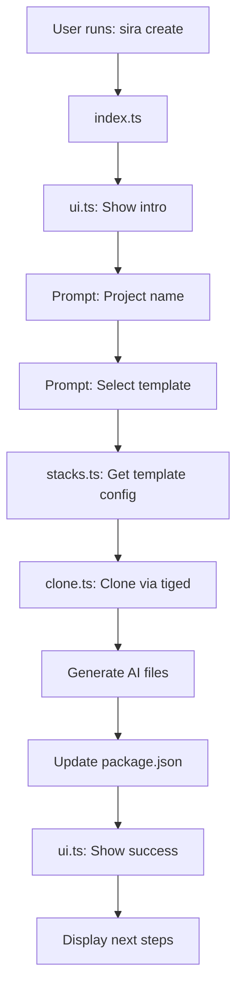

**User:**

<task>
Hi Bob est ce que tu es prêt pour notre sprint ??
</task>
<environment_details>
# VSCode Visible Files


# VSCode Open Tabs


# Current Time
Current time in ISO 8601 UTC format: 2026-05-15T16:39:31.267Z
User time zone: Africa/Porto-Novo, UTC+1:00

# Current Cost
$0.00

# Review Exclusions
The following file patterns are excluded from code reviews:
- .vscode/**

# Current Mode
<slug>plan</slug>
<name>📝 Plan</name>


# Current Workspace Directory (/home/pniel/sira) Files
No files found.
You have not created a todo list yet. Create one with `update_todo_list` if your task is complicated or involves multiple steps.
</environment_details>

---

**Assistant:**

Bonjour ! Oui, je suis prêt pour le sprint ! 🚀

Je remarque que nous sommes dans un workspace vide (`/home/pniel/sira`). Avant de créer un plan détaillé, j'ai besoin de comprendre ce que nous allons accomplir pendant ce sprint.

<ask_followup_question>
<question>Quel est l'objectif principal de ce sprint ? Pouvez-vous me donner plus de détails sur ce que nous devons accomplir ?</question>
<follow_up>
<suggest>Développer une nouvelle fonctionnalité pour une application existante</suggest>
<suggest>Créer un nouveau projet from scratch (web app, API, etc.)</suggest>
<suggest>Corriger des bugs et améliorer du code existant</suggest>
<suggest>Mettre en place une infrastructure ou architecture système</suggest>
</follow_up>
</ask_followup_question>

---

**User:**

[ask_followup_question for 'Quel est l'objectif principal de ce sprint ? Pouvez-vous me donner plus de détails sur ce que nous devons accomplir ?'] Result:
<answer>
On lis le fichier 'PROJECT.md' (see below for file content) que j'ai créé pour t'expliquer le concept chacune des décisions qu'elle contient sont à prendre avec pincette nous allons les analyser te décider à chaque étape
</answer>

<file_content path="PROJECT.md">
  1 | # AGENTS.md — Sira Project Context
  2 | 
  3 | > This file provides full context for any AI development partner (IBM Bob, Claude, Cursor, etc.)
  4 | > working on the Sira project. Read this before doing anything else.
  5 | 
  6 | ---
  7 | 
  8 | ## What is Sira?
  9 | 
 10 | **Sira** is an open source CLI scaffolding tool designed to be **AI-friendly by design**.
 11 | 
 12 | Most project scaffolding tools generate code and stop there. Sira goes further: every project it
 13 | creates is immediately ready to work with AI coding tools like IBM Bob, Claude Code, Cursor, and
 14 | GitHub Copilot — with context files, documentation stubs, and structured conventions built in
 15 | from day one.
 16 | 
 17 | The core idea: **the best moment to set up AI context is at project creation, not as an
 18 | afterthought.**
 19 | 
 20 | > Built during the IBM Bob Hackathon (May 2026) — Theme: "Turn idea into impact faster"
 21 | 
 22 | ---
 23 | 
 24 | ## The Problem Sira Solves
 25 | 
 26 | When a developer starts a new project today, they typically:
 27 | 1. Run a scaffolding command (Vite, create-react-app, Express generator...)
 28 | 2. Get a bare-bones file structure
 29 | 3. Spend hours configuring tooling, writing docs, setting up conventions
 30 | 4. Realize their AI coding tool has no project context and keeps giving generic answers
 31 | 
 32 | Sira collapses steps 2, 3, and 4 into the scaffolding step itself.
 33 | 
 34 | ---
 35 | 
 36 | ## Core Philosophy
 37 | 
 38 | - **AI-friendly by default** — every generated project includes CLAUDE.md, AGENTS.md, and
 39 |   .cursorrules with real, useful content (not empty stubs)
 40 | - **Named templates** — templates follow a mythological naming system (Greek gods) to make
 41 |   them memorable and distinct
 42 | - **Minimal and focused** — Sira does one thing well: scaffold projects that are ready to build
 43 | - **Open source** — designed for contributors, with clear architecture and typed interfaces
 44 | 
 45 | ---
 46 | 
 47 | ## Repository Structure
 48 | 
 49 | This project uses **two GitHub repositories**:
 50 | 
 51 | ```
 52 | github.com/sira-cli/sira          ← The CLI tool (this repo)
 53 | github.com/sira-cli/templates     ← The project templates
 54 | ```
 55 | 
 56 | ### CLI Repo Structure (`sira-cli/sira`)
 57 | 
 58 | ```
 59 | sira/
 60 | ├── src/
 61 | │   ├── index.ts          # Entry point — CLI commands registration
 62 | │   ├── ui.ts             # Design system — colors, spinners, prompts
 63 | │   ├── stacks.ts         # Template registry — typed list of available templates
 64 | │   └── clone.ts          # Clone pipeline — pulls templates via tiged
 65 | ├── package.json
 66 | ├── tsconfig.json
 67 | ├── AGENTS.md             # This file
 68 | ├── CLAUDE.md             # Claude-specific context
 69 | ├── .cursorrules          # Cursor-specific context
 70 | └── LICENSE               # MIT
 71 | ```
 72 | 
 73 | ### Templates Repo Structure (`sira-cli/templates`)
 74 | 
 75 | ```
 76 | templates/
 77 | ├── react-hermes/         # React + Vite + TypeScript
 78 | ├── node-ares/            # Node.js + Express + TypeScript
 79 | └── django-athena/        # Django + Python
 80 | ```
 81 | 
 82 | ---
 83 | 
 84 | ## Tech Stack (CLI)
 85 | 
 86 | | Tool | Version | Role |
 87 | |------|---------|------|
 88 | | Node.js | v24+ | Runtime |
 89 | | TypeScript | Latest | Language |
 90 | | ESM | Native | Module system (no CommonJS) |
 91 | | @clack/core | Latest | Interactive CLI prompts |
 92 | | picocolors | Latest | Terminal colors |
 93 | | tiged | Latest | Template cloning (degit alternative, Node 24 compatible) |
 94 | | tsx | Latest | TypeScript execution during dev |
 95 | 
 96 | **Important:** This project uses **pure ESM**. No CommonJS. All imports use `.js` extensions
 97 | even for TypeScript files (ESM resolution requirement).
 98 | 
 99 | ---
100 | 
101 | ## Template Naming System (Mythological)
102 | 
103 | Templates are named after Greek gods, each reflecting the nature of the stack:
104 | 
105 | | Code Name | Stack | God Symbolism |
106 | |-----------|-------|---------------|
107 | | **HERMÈS** | React + Vite + TypeScript | Speed, messenger — fast frontend |
108 | | **ARÈS** | Node.js + Express + TypeScript | Power, force — robust backend |
109 | | **ATHÉNA** | Django + Python | Wisdom, strategy — structured fullstack |
110 | 
111 | More templates planned post-hackathon:
112 | - **APHRODITE** — Next.js + Tailwind (beautiful, full-featured)
113 | - **HADÈS** — CLI tool template (underground, powerful tooling)
114 | 
115 | ---
116 | 
117 | ## Template Interface (TypeScript)
118 | 
119 | Every template in `stacks.ts` follows this typed interface:
120 | 
121 | ```typescript
122 | interface Stack {
123 |   id: string;           // e.g. "react-hermes"
124 |   name: string;         // e.g. "HERMÈS"
125 |   description: string;  // Short description shown in CLI
126 |   tech: string[];       // e.g. ["React", "Vite", "TypeScript"]
127 |   repo: string;         // GitHub path: "sira-cli/templates/react-hermes"
128 |   aiFiles: {            // AI context files to generate
129 |     claude: string;     // Content for CLAUDE.md
130 |     agents: string;     // Content for AGENTS.md
131 |     cursorrules: string;// Content for .cursorrules
132 |   };
133 | }
134 | ```
135 | 
136 | ---
137 | 
138 | ## CLI Commands
139 | 
140 | ### `sira create`
141 | The main command. Walks the user through an interactive prompt to:
142 | 1. Enter project name
143 | 2. Choose a template (HERMÈS, ARÈS, ATHÉNA)
144 | 3. Clone the template into a new folder
145 | 4. Generate AI context files (CLAUDE.md, AGENTS.md, .cursorrules)
146 | 5. Run `npm install` (or `pip install` for Python)
147 | 6. Show success message with next steps
148 | 
149 | ### `sira list`
150 | Lists all available templates with their tech stack and description.
151 | 
152 | ---
153 | 
154 | ## UI Design System (`ui.ts`)
155 | 
156 | The CLI uses a consistent visual design:
157 | 
158 | ```
159 | Colors:
160 |   Primary   → cyan (brand color)
161 |   Success   → green
162 |   Error     → red
163 |   Warning   → yellow
164 |   Muted     → gray (secondary info)
165 | 
166 | Structure:
167 |   intro()   → Shows Sira logo + version on start
168 |   step()    → Shows a numbered step with cyan label
169 |   success() → Green checkmark + message
170 |   error()   → Red X + message
171 |   spinner() → Animated spinner during async ops
172 | ```
173 | 
174 | ---
175 | 
176 | ## Clone Pipeline (`clone.ts`)
177 | 
178 | Uses **tiged** (not degit — degit is incompatible with Node 24) to pull templates:
179 | 
180 | ```typescript
181 | // Conceptual flow
182 | async function cloneTemplate(stack: Stack, projectName: string) {
183 |   const emitter = tiged(`${stack.repo}`, { cache: false, force: true });
184 |   await emitter.clone(`./${projectName}`);
185 |   await generateAIFiles(projectName, stack);
186 |   await installDependencies(projectName, stack);
187 | }
188 | ```
189 | 
190 | ---
191 | 
192 | ## AI Context Files Generated Per Project
193 | 
194 | When Sira creates a project, it generates these files automatically:
195 | 
196 | ### `CLAUDE.md`
197 | Tells Claude Code about the project: stack, conventions, commands to run, architecture overview.
198 | 
199 | ### `AGENTS.md`
200 | Tells any AI agent about the project structure, goals, and how to contribute effectively.
201 | 
202 | ### `.cursorrules`
203 | Cursor-specific rules for code style, conventions, and preferred patterns.
204 | 
205 | ---
206 | 
207 | ## Hackathon Context
208 | 
209 | - **Event:** IBM Bob Hackathon — lablab.ai (May 15–17, 2026)
210 | - **Theme:** "Turn idea into impact faster"
211 | - **Team:** Lumis (solo — Péniel)
212 | - **IBM Bob Role:** Bob is used as the primary development partner throughout the build.
213 |   All Bob task sessions are exported and stored in `/bob_sessions/` for judging.
214 | 
215 | ### Why Sira fits the hackathon theme perfectly:
216 | - Reduces setup time from hours to minutes ✓
217 | - Helps builders at any skill level start with confidence ✓
218 | - AI-native by design — built for the age of AI coding tools ✓
219 | - Uses IBM Bob to build a tool that helps other developers use AI better ✓
220 | 
221 | ---
222 | 
223 | ## What IBM Bob Should Help With
224 | 
225 | When working on this project with Bob, the primary tasks are:
226 | 
227 | 1. **Implement `ui.ts`** — the CLI design system with @clack/core and picocolors
228 | 2. **Implement `stacks.ts`** — the typed template registry with 3 initial templates
229 | 3. **Implement `clone.ts`** — the tiged-based clone pipeline
230 | 4. **Implement `index.ts`** — the main CLI entry point wiring everything together
231 | 5. **Create template structures** — the actual template folders in the templates repo
232 | 6. **Generate AI context file content** — meaningful CLAUDE.md/AGENTS.md per template
233 | 7. **Write tests** — basic unit tests for core functions
234 | 8. **Generate documentation** — README with usage examples
235 | 
236 | ---
237 | 
238 | ## Conventions & Rules for Bob
239 | 
240 | - **Always use TypeScript** — no plain JavaScript files in `src/`
241 | - **Always use ESM** — `import/export`, never `require()`
242 | - **Import extensions** — always add `.js` to local imports (e.g. `import { ui } from './ui.js'`)
243 | - **Async/await** — no raw Promises or callbacks
244 | - **Error handling** — wrap all async operations in try/catch, show user-friendly errors via `ui.error()`
245 | - **No default exports** — use named exports everywhere
246 | - **Consistent naming** — camelCase for variables/functions, PascalCase for types/interfaces
247 | 
248 | ---
249 | 
250 | ## Current Status
251 | 
252 | > As of hackathon start (May 15, 2026):
253 | 
254 | - [x] Repository created on GitHub (`sira-cli/sira`)
255 | - [x] MIT License added
256 | - [x] AGENTS.md written (this file)
257 | - [ ] `package.json` configured
258 | - [ ] `tsconfig.json` configured
259 | - [ ] `src/ui.ts` implemented
260 | - [ ] `src/stacks.ts` implemented
261 | - [ ] `src/clone.ts` implemented
262 | - [ ] `src/index.ts` implemented
263 | - [ ] Templates repo created
264 | - [ ] `react-hermes` template created
265 | - [ ] `node-ares` template created
266 | - [ ] `django-athena` template created
267 | - [ ] README written
268 | - [ ] Tests written
269 | 
270 | ---
271 | 
272 | ## Links
273 | 
274 | - CLI Repo: https://github.com/sira-cli/sira
275 | - Templates Repo: https://github.com/sira-cli/templates
276 | - Hackathon: https://lablab.ai (IBM Bob Hackathon, May 2026)
277 | - IBM Bob Guide: https://watsonx-hackathons-2026.s3.us.cloud-object-storage.appdomain.cloud/Lablab-IBM-Bob-hackathon-guide-May-2026.pdf

</file_content>
<environment_details>
# VSCode Visible Files
PROJECT.md

# VSCode Open Tabs
PROJECT.md

# Current Time
Current time in ISO 8601 UTC format: 2026-05-15T16:45:27.086Z
User time zone: Africa/Porto-Novo, UTC+1:00

# Current Cost
$0.03

# Review Exclusions
The following file patterns are excluded from code reviews:
- .vscode/**

# Current Mode
<slug>plan</slug>
<name>📝 Plan</name>
You have not created a todo list yet. Create one with `update_todo_list` if your task is complicated or involves multiple steps.
</environment_details>

---

**Assistant:**

Excellent ! J'ai lu le [`PROJECT.md`](PROJECT.md) et je comprends maintenant le contexte complet du projet **Sira**. C'est un projet très intéressant pour le hackathon IBM Bob ! 🚀

Laissez-moi d'abord explorer la structure actuelle du projet pour voir ce qui existe déjà.

<list_files>
<path>.</path>
<recursive>true</recursive>
</list_files>

---

**User:**

[list_files for '.'] Result:
PROJECT.md
<environment_details>
# VSCode Visible Files
PROJECT.md

# VSCode Open Tabs
PROJECT.md

# Current Time
Current time in ISO 8601 UTC format: 2026-05-15T16:45:51.979Z
User time zone: Africa/Porto-Novo, UTC+1:00

# Current Cost
$0.07

# Review Exclusions
The following file patterns are excluded from code reviews:
- .vscode/**

# Current Mode
<slug>plan</slug>
<name>📝 Plan</name>
You have not created a todo list yet. Create one with `update_todo_list` if your task is complicated or involves multiple steps.
</environment_details>

---

**Assistant:**

Parfait ! Je vois que nous partons d'un workspace presque vide avec seulement le [`PROJECT.md`](PROJECT.md). C'est le début du sprint pour construire **Sira**, l'outil CLI de scaffolding AI-friendly.

Avant de créer le plan détaillé, j'ai quelques questions importantes pour m'assurer que nous prenons les bonnes décisions à chaque étape :

<ask_followup_question>
<question>Pour ce sprint, quel est notre objectif principal ? Voulez-vous que nous construisions le CLI complet avec les 3 templates (HERMÈS, ARÈS, ATHÉNA), ou préférez-vous commencer par une version MVP avec un seul template pour valider l'approche ?</question>
<follow_up>
<suggest>MVP avec un seul template (HERMÈS - React) pour valider rapidement le concept</suggest>
<suggest>CLI complet avec les 3 templates (HERMÈS, ARÈS, ATHÉNA) comme décrit dans PROJECT.md</suggest>
<suggest>Seulement l'infrastructure du CLI (ui.ts, stacks.ts, clone.ts, index.ts) sans les templates pour l'instant</suggest>
<suggest>Commencer par la structure complète et implémenter progressivement chaque partie</suggest>
</follow_up>
</ask_followup_question>

---

**User:**

[ask_followup_question for 'Pour ce sprint, quel est notre objectif principal ? Voulez-vous que nous construisions le CLI complet avec les 3 templates (HERMÈS, ARÈS, ATHÉNA), ou préférez-vous commencer par une version MVP avec un seul template pour valider l'approche ?'] Result:
<answer>
MVP avec un seul template (HERMÈS - React) pour valider rapidement le concept
</answer>
<environment_details>
# VSCode Visible Files
PROJECT.md

# VSCode Open Tabs
PROJECT.md

# Current Time
Current time in ISO 8601 UTC format: 2026-05-15T16:46:38.980Z
User time zone: Africa/Porto-Novo, UTC+1:00

# Current Cost
$0.11

# Review Exclusions
The following file patterns are excluded from code reviews:
- .vscode/**

# Current Mode
<slug>plan</slug>
<name>📝 Plan</name>
You have not created a todo list yet. Create one with `update_todo_list` if your task is complicated or involves multiple steps.
</environment_details>

---

**Assistant:**

Excellente décision ! Un MVP avec HERMÈS (React) est la meilleure approche pour valider rapidement le concept. Maintenant, j'ai une autre question importante concernant l'architecture :

<ask_followup_question>
<question>Concernant le repository des templates, voulez-vous que nous créions un vrai repository GitHub séparé (sira-cli/templates) ou préférez-vous pour le MVP utiliser une approche plus simple (templates locaux dans le même repo, ou utiliser un repo existant comme exemple) ?</question>
<follow_up>
<suggest>Créer un vrai repository GitHub séparé sira-cli/templates (approche production)</suggest>
<suggest>Garder les templates dans un dossier local ./templates pour le MVP (plus simple pour tester)</suggest>
<suggest>Utiliser un template React existant sur GitHub comme proof of concept</suggest>
<suggest>Créer les templates localement maintenant, migration vers GitHub repo séparé plus tard</suggest>
</follow_up>
</ask_followup_question>

---

**User:**

[ask_followup_question for 'Concernant le repository des templates, voulez-vous que nous créions un vrai repository GitHub séparé (sira-cli/templates) ou préférez-vous pour le MVP utiliser une approche plus simple (templates locaux dans le même repo, ou utiliser un repo existant comme exemple) ?'] Result:
<answer>
Créer un vrai repository GitHub séparé sira-cli/templates (approche production)
</answer>
<environment_details>
# VSCode Visible Files
PROJECT.md

# VSCode Open Tabs
PROJECT.md

# Current Time
Current time in ISO 8601 UTC format: 2026-05-15T16:47:55.132Z
User time zone: Africa/Porto-Novo, UTC+1:00

# Current Cost
$0.15

# Review Exclusions
The following file patterns are excluded from code reviews:
- .vscode/**

# Current Mode
<slug>plan</slug>
<name>📝 Plan</name>
You have not created a todo list yet. Create one with `update_todo_list` if your task is complicated or involves multiple steps.
</environment_details>

---

**Assistant:**

Parfait ! Approche production dès le départ. Une dernière question importante avant de créer le plan détaillé :

<ask_followup_question>
<question>Pour le template HERMÈS (React + Vite + TypeScript), voulez-vous que nous créions un template minimal et épuré, ou un template plus complet avec des exemples de composants, routing, et bonnes pratiques ?</question>
<follow_up>
<suggest>Template minimal - juste la structure de base Vite + React + TypeScript + fichiers AI</suggest>
<suggest>Template complet - avec React Router, exemples de composants, structure de dossiers organisée, et bonnes pratiques</suggest>
<suggest>Template intermédiaire - structure de base + quelques composants d'exemple + routing basique</suggest>
<suggest>Template "batteries included" - tout ce qu'il faut pour démarrer un vrai projet (state management, tests, etc.)</suggest>
</follow_up>
</ask_followup_question>

---

**User:**

[ask_followup_question for 'Pour le template HERMÈS (React + Vite + TypeScript), voulez-vous que nous créions un template minimal et épuré, ou un template plus complet avec des exemples de composants, routing, et bonnes pratiques ?'] Result:
<answer>
Template minimal - juste la structure de base Vite + React + TypeScript + fichiers AI
</answer>
<environment_details>
# VSCode Visible Files
PROJECT.md

# VSCode Open Tabs
PROJECT.md

# Current Time
Current time in ISO 8601 UTC format: 2026-05-15T16:48:57.102Z
User time zone: Africa/Porto-Novo, UTC+1:00

# Current Cost
$0.19

# Review Exclusions
The following file patterns are excluded from code reviews:
- .vscode/**

# Current Mode
<slug>plan</slug>
<name>📝 Plan</name>
You have not created a todo list yet. Create one with `update_todo_list` if your task is complicated or involves multiple steps.
</environment_details>

---

**Assistant:**

Excellent ! Approche minimaliste et focalisée. Maintenant je vais créer un plan détaillé pour construire le MVP de Sira avec le template HERMÈS.

<update_todo_list>
<todos>
[ ] Analyser et valider l'architecture technique du projet
[ ] Configurer le projet CLI (package.json, tsconfig.json, structure ESM)
[ ] Implémenter le système de design UI (ui.ts avec @clack/core et picocolors)
[ ] Créer le registre des templates (stacks.ts avec interface TypeScript)
[ ] Implémenter le pipeline de clonage (clone.ts avec tiged)
[ ] Créer le point d'entrée CLI (index.ts avec commandes create et list)
[ ] Créer le repository GitHub sira-cli/templates
[ ] Créer le template HERMÈS (React + Vite + TypeScript minimal)
[ ] Générer les fichiers AI contextuels (CLAUDE.md, AGENTS.md, .cursorrules)
[ ] Tester le CLI en local avec le template HERMÈS
[ ] Créer la documentation (README.md avec exemples d'utilisation)
[ ] Préparer le package pour publication npm (optionnel pour MVP)
</todos>
</update_todo_list>

---

**User:**

[update_todo_list] Result:
Todo list updated successfully.
<environment_details>
# VSCode Visible Files
PROJECT.md

# VSCode Open Tabs
PROJECT.md

# Current Time
Current time in ISO 8601 UTC format: 2026-05-15T16:49:16.645Z
User time zone: Africa/Porto-Novo, UTC+1:00

# Current Cost
$0.24

# Review Exclusions
The following file patterns are excluded from code reviews:
- .vscode/**

# Current Mode
<slug>plan</slug>
<name>📝 Plan</name>
====

REMINDERS

Below is your current list of reminders for this task. Keep them updated as you progress.

| # | Content | Status |
|---|---------|--------|
| 1 | Analyser et valider l'architecture technique du projet | Pending |
| 2 | Configurer le projet CLI (package.json, tsconfig.json, structure ESM) | Pending |
| 3 | Implémenter le système de design UI (ui.ts avec @clack/core et picocolors) | Pending |
| 4 | Créer le registre des templates (stacks.ts avec interface TypeScript) | Pending |
| 5 | Implémenter le pipeline de clonage (clone.ts avec tiged) | Pending |
| 6 | Créer le point d'entrée CLI (index.ts avec commandes create et list) | Pending |
| 7 | Créer le repository GitHub sira-cli/templates | Pending |
| 8 | Créer le template HERMÈS (React + Vite + TypeScript minimal) | Pending |
| 9 | Générer les fichiers AI contextuels (CLAUDE.md, AGENTS.md, .cursorrules) | Pending |
| 10 | Tester le CLI en local avec le template HERMÈS | Pending |
| 11 | Créer la documentation (README.md avec exemples d'utilisation) | Pending |
| 12 | Préparer le package pour publication npm (optionnel pour MVP) | Pending |


IMPORTANT: When task status changes, remember to call the `update_todo_list` tool to update your progress.

</environment_details>

---

**Assistant:**

Parfait ! Maintenant, laissez-moi créer un plan détaillé avec une architecture claire. Je vais analyser l'architecture technique et créer un document de planification.

<update_todo_list>
<todos>
[-] Analyser et valider l'architecture technique du projet
[ ] Configurer le projet CLI (package.json, tsconfig.json, structure ESM)
[ ] Implémenter le système de design UI (ui.ts avec @clack/core et picocolors)
[ ] Créer le registre des templates (stacks.ts avec interface TypeScript)
[ ] Implémenter le pipeline de clonage (clone.ts avec tiged)
[ ] Créer le point d'entrée CLI (index.ts avec commandes create et list)
[ ] Créer le repository GitHub sira-cli/templates
[ ] Créer le template HERMÈS (React + Vite + TypeScript minimal)
[ ] Générer les fichiers AI contextuels (CLAUDE.md, AGENTS.md, .cursorrules)
[ ] Tester le CLI en local avec le template HERMÈS
[ ] Créer la documentation (README.md avec exemples d'utilisation)
[ ] Préparer le package pour publication npm (optionnel pour MVP)
</todos>
</update_todo_list>

---

**User:**

[update_todo_list] Result:
Todo list updated successfully.
<environment_details>
# VSCode Visible Files
PROJECT.md

# VSCode Open Tabs
PROJECT.md

# Current Time
Current time in ISO 8601 UTC format: 2026-05-15T16:49:24.442Z
User time zone: Africa/Porto-Novo, UTC+1:00

# Current Cost
$0.28

# Review Exclusions
The following file patterns are excluded from code reviews:
- .vscode/**

# Current Mode
<slug>plan</slug>
<name>📝 Plan</name>
====

REMINDERS

Below is your current list of reminders for this task. Keep them updated as you progress.

| # | Content | Status |
|---|---------|--------|
| 1 | Analyser et valider l'architecture technique du projet | In Progress |
| 2 | Configurer le projet CLI (package.json, tsconfig.json, structure ESM) | Pending |
| 3 | Implémenter le système de design UI (ui.ts avec @clack/core et picocolors) | Pending |
| 4 | Créer le registre des templates (stacks.ts avec interface TypeScript) | Pending |
| 5 | Implémenter le pipeline de clonage (clone.ts avec tiged) | Pending |
| 6 | Créer le point d'entrée CLI (index.ts avec commandes create et list) | Pending |
| 7 | Créer le repository GitHub sira-cli/templates | Pending |
| 8 | Créer le template HERMÈS (React + Vite + TypeScript minimal) | Pending |
| 9 | Générer les fichiers AI contextuels (CLAUDE.md, AGENTS.md, .cursorrules) | Pending |
| 10 | Tester le CLI en local avec le template HERMÈS | Pending |
| 11 | Créer la documentation (README.md avec exemples d'utilisation) | Pending |
| 12 | Préparer le package pour publication npm (optionnel pour MVP) | Pending |


IMPORTANT: When task status changes, remember to call the `update_todo_list` tool to update your progress.

</environment_details>

---

**Assistant:**

Maintenant, je vais créer un document de planification détaillé avec l'architecture technique et les décisions à valider.

<write_to_file>
<path>SPRINT_PLAN.md</path>
<content># Sprint Plan - Sira MVP (HERMÈS Template)

> Plan détaillé pour le développement du MVP de Sira avec le template HERMÈS
> Sprint: IBM Bob Hackathon (May 15-17, 2026)

---

## 🎯 Objectif du Sprint

Créer un CLI fonctionnel qui permet de scaffolder un projet React + Vite + TypeScript avec des fichiers AI contextuels pré-configurés.

**Scope MVP:**
- ✅ Un seul template: HERMÈS (React + Vite + TypeScript)
- ✅ Repository GitHub séparé pour les templates
- ✅ Template minimal (pas de routing, pas de state management)
- ✅ Fichiers AI contextuels générés automatiquement

---

## 🏗️ Architecture Technique

### Structure des Repositories

```
github.com/sira-cli/sira (CLI)
├── src/
│   ├── index.ts          # Entry point + CLI commands
│   ├── ui.ts             # Design system (@clack/core + picocolors)
│   ├── stacks.ts         # Template registry (typed)
│   └── clone.ts          # Clone pipeline (tiged)
├── package.json
├── tsconfig.json
├── PROJECT.md            # Context (existant)
└── README.md

github.com/sira-cli/templates
└── react-hermes/         # Template HERMÈS
    ├── package.json
    ├── tsconfig.json
    ├── vite.config.ts
    ├── index.html
    ├── src/
    │   ├── main.tsx
    │   ├── App.tsx
    │   └── vite-env.d.ts
    ├── CLAUDE.md         # AI context for Claude
    ├── AGENTS.md         # AI context for all agents
    └── .cursorrules      # Cursor-specific rules
```

### Tech Stack (CLI)

| Dépendance | Version | Rôle | Notes |
|------------|---------|------|-------|
| Node.js | v24+ | Runtime | Requis pour ESM natif |
| TypeScript | Latest | Language | Pure ESM, extensions `.js` |
| @clack/core | Latest | CLI prompts | Interactive UX |
| @clack/prompts | Latest | Prompt helpers | Simplification |
| picocolors | Latest | Terminal colors | Léger et rapide |
| tiged | Latest | Template cloning | Compatible Node 24 |
| tsx | Latest | Dev execution | TypeScript runner |

### Décisions Techniques Clés

#### 1. ESM Pure (Pas de CommonJS)
```typescript
// ✅ Correct
import { ui } from './ui.js';  // Extension .js obligatoire
export { createProject };

// ❌ Incorrect
const ui = require('./ui');
module.exports = { createProject };
```

#### 2. Structure des Imports
```json
// package.json
{
  "type": "module",
  "exports": {
    ".": "./dist/index.js"
  }
}
```

#### 3. TypeScript Configuration
```json
// tsconfig.json
{
  "compilerOptions": {
    "module": "ESNext",
    "moduleResolution": "bundler",
    "target": "ES2022",
    "outDir": "./dist"
  }
}
```

---

## 📋 Plan d'Implémentation Détaillé

### Phase 1: Configuration du Projet CLI

#### 1.1 - package.json
```json
{
  "name": "sira",
  "version": "0.1.0",
  "type": "module",
  "bin": {
    "sira": "./dist/index.js"
  },
  "scripts": {
    "dev": "tsx src/index.ts",
    "build": "tsc",
    "start": "node dist/index.js"
  },
  "dependencies": {
    "@clack/core": "^0.3.4",
    "@clack/prompts": "^0.7.0",
    "picocolors": "^1.0.0",
    "tiged": "^2.12.7"
  },
  "devDependencies": {
    "@types/node": "^20.11.0",
    "tsx": "^4.7.0",
    "typescript": "^5.3.3"
  }
}
```

**Décisions à valider:**
- ✅ Version 0.1.0 pour le MVP
- ✅ Nom du package: `sira` (simple et mémorable)
- ⚠️ Vérifier disponibilité sur npm

#### 1.2 - tsconfig.json
```json
{
  "compilerOptions": {
    "target": "ES2022",
    "module": "ESNext",
    "moduleResolution": "bundler",
    "lib": ["ES2022"],
    "outDir": "./dist",
    "rootDir": "./src",
    "strict": true,
    "esModuleInterop": true,
    "skipLibCheck": true,
    "forceConsistentCasingInFileNames": true,
    "resolveJsonModule": true,
    "declaration": true,
    "declarationMap": true,
    "sourceMap": true
  },
  "include": ["src/**/*"],
  "exclude": ["node_modules", "dist"]
}
```

**Décisions à valider:**
- ✅ Target ES2022 (moderne, compatible Node 24)
- ✅ Strict mode activé (qualité du code)

---

### Phase 2: Implémentation du Design System (ui.ts)

#### 2.1 - Palette de Couleurs
```typescript
import pc from 'picocolors';

export const colors = {
  primary: pc.cyan,      // Brand color
  success: pc.green,     // Success messages
  error: pc.red,         // Error messages
  warning: pc.yellow,    // Warnings
  muted: pc.gray,        // Secondary info
  bold: pc.bold,         // Emphasis
};
```

#### 2.2 - Composants UI
```typescript
// Logo ASCII art
export function showLogo() {
  console.log(colors.primary(`
   _____ _           
  / ____(_)          
 | (___  _ _ __ __ _ 
  \\___ \\| | '__/ _\` |
  ____) | | | | (_| |
 |_____/|_|_|  \\__,_|
  `));
}

// Messages formatés
export const ui = {
  intro: () => showLogo(),
  step: (num: number, text: string) => 
    console.log(`${colors.primary(`[${num}]`)} ${text}`),
  success: (text: string) => 
    console.log(`${colors.success('✓')} ${text}`),
  error: (text: string) => 
    console.log(`${colors.error('✗')} ${text}`),
  info: (text: string) => 
    console.log(`${colors.muted('ℹ')} ${text}`),
};
```

**Décisions à valider:**
- ✅ Cyan comme couleur principale (moderne, tech)
- ✅ Logo ASCII simple et reconnaissable
- ⚠️ Tester le rendu sur différents terminaux

---

### Phase 3: Registre des Templates (stacks.ts)

#### 3.1 - Interface TypeScript
```typescript
export interface Stack {
  id: string;           // "react-hermes"
  name: string;         // "HERMÈS"
  description: string;  // Description courte
  tech: string[];       // ["React", "Vite", "TypeScript"]
  repo: string;         // "sira-cli/templates/react-hermes"
  aiFiles: {
    claude: string;     // Contenu CLAUDE.md
    agents: string;     // Contenu AGENTS.md
    cursorrules: string;// Contenu .cursorrules
  };
}
```

#### 3.2 - Template HERMÈS
```typescript
export const stacks: Stack[] = [
  {
    id: 'react-hermes',
    name: 'HERMÈS',
    description: 'React + Vite + TypeScript — Fast frontend development',
    tech: ['React', 'Vite', 'TypeScript'],
    repo: 'sira-cli/templates/react-hermes',
    aiFiles: {
      claude: generateClaudeContent(),
      agents: generateAgentsContent(),
      cursorrules: generateCursorRules(),
    },
  },
];
```

**Décisions à valider:**
- ✅ Un seul template pour le MVP
- ✅ Nom mythologique: HERMÈS (vitesse, messager)
- ⚠️ Contenu des fichiers AI à définir précisément

---

### Phase 4: Pipeline de Clonage (clone.ts)

#### 4.1 - Fonction Principale
```typescript
import tiged from 'tiged';
import { writeFile, mkdir } from 'fs/promises';
import { join } from 'path';
import type { Stack } from './stacks.js';

export async function cloneTemplate(
  stack: Stack,
  projectName: string,
  targetDir: string = process.cwd()
) {
  const projectPath = join(targetDir, projectName);
  
  // 1. Clone template via tiged
  const emitter = tiged(stack.repo, { 
    cache: false, 
    force: true 
  });
  
  await emitter.clone(projectPath);
  
  // 2. Generate AI context files
  await generateAIFiles(projectPath, stack);
  
  // 3. Update package.json with project name
  await updatePackageJson(projectPath, projectName);
  
  return projectPath;
}
```

#### 4.2 - Génération des Fichiers AI
```typescript
async function generateAIFiles(projectPath: string, stack: Stack) {
  const files = [
    { name: 'CLAUDE.md', content: stack.aiFiles.claude },
    { name: 'AGENTS.md', content: stack.aiFiles.agents },
    { name: '.cursorrules', content: stack.aiFiles.cursorrules },
  ];
  
  for (const file of files) {
    await writeFile(
      join(projectPath, file.name),
      file.content,
      'utf-8'
    );
  }
}
```

**Décisions à valider:**
- ✅ Utiliser tiged (compatible Node 24)
- ✅ Générer les fichiers AI après le clonage
- ⚠️ Gestion des erreurs (repo inexistant, permissions, etc.)

---

### Phase 5: Point d'Entrée CLI (index.ts)

#### 5.1 - Structure Principale
```typescript
#!/usr/bin/env node

import { intro, outro, select, text, spinner } from '@clack/prompts';
import { ui, colors } from './ui.js';
import { stacks } from './stacks.js';
import { cloneTemplate } from './clone.js';

async function main() {
  ui.intro();
  
  const command = process.argv[2];
  
  if (command === 'create') {
    await createCommand();
  } else if (command === 'list') {
    await listCommand();
  } else {
    showHelp();
  }
}

main().catch(console.error);
```

#### 5.2 - Commande `create`
```typescript
async function createCommand() {
  // 1. Demander le nom du projet
  const projectName = await text({
    message: 'Project name?',
    placeholder: 'my-awesome-app',
    validate: (value) => {
      if (!value) return 'Project name is required';
      if (!/^[a-z0-9-]+$/.test(value)) 
        return 'Use lowercase letters, numbers, and hyphens only';
    },
  });
  
  // 2. Sélectionner le template
  const stackId = await select({
    message: 'Choose a template:',
    options: stacks.map(s => ({
      value: s.id,
      label: `${s.name} — ${s.description}`,
      hint: s.tech.join(', '),
    })),
  });
  
  // 3. Cloner le template
  const s = spinner();
  s.start('Creating project...');
  
  const stack = stacks.find(s => s.id === stackId);
  await cloneTemplate(stack, projectName);
  
  s.stop('Project created!');
  
  // 4. Afficher les prochaines étapes
  showNextSteps(projectName);
}
```

#### 5.3 - Commande `list`
```typescript
async function listCommand() {
  console.log('\nAvailable templates:\n');
  
  stacks.forEach(stack => {
    console.log(colors.primary(`  ${stack.name}`));
    console.log(`  ${stack.description}`);
    console.log(colors.muted(`  Tech: ${stack.tech.join(', ')}\n`));
  });
}
```

**Décisions à valider:**
- ✅ Deux commandes: `create` et `list`
- ✅ Validation du nom de projet (lowercase, hyphens)
- ⚠️ Ajouter une commande `--help` ?

---

### Phase 6: Template HERMÈS

#### 6.1 - Structure Minimale
```
react-hermes/
├── package.json
├── tsconfig.json
├── vite.config.ts
├── index.html
├── .gitignore
├── src/
│   ├── main.tsx
│   ├── App.tsx
│   ├── App.css
│   └── vite-env.d.ts
└── public/
    └── vite.svg
```

#### 6.2 - package.json du Template
```json
{
  "name": "project-name",
  "private": true,
  "version": "0.0.0",
  "type": "module",
  "scripts": {
    "dev": "vite",
    "build": "tsc && vite build",
    "preview": "vite preview"
  },
  "dependencies": {
    "react": "^18.2.0",
    "react-dom": "^18.2.0"
  },
  "devDependencies": {
    "@types/react": "^18.2.43",
    "@types/react-dom": "^18.2.17",
    "@vitejs/plugin-react": "^4.2.1",
    "typescript": "^5.2.2",
    "vite": "^5.0.8"
  }
}
```

#### 6.3 - App.tsx Minimal
```tsx
import { useState } from 'react';
import './App.css';

function App() {
  const [count, setCount] = useState(0);

  return (
    <div className="App">
      <h1>Welcome to Your New Project</h1>
      <p>Built with React + Vite + TypeScript</p>
      <button onClick={() => setCount(count + 1)}>
        Count: {count}
      </button>
    </div>
  );
}

export default App;
```

**Décisions à valider:**
- ✅ Template ultra-minimal (juste un compteur)
- ✅ Pas de routing, pas de state management
- ⚠️ Inclure un fichier CSS de base ?

---

### Phase 7: Fichiers AI Contextuels

#### 7.1 - CLAUDE.md (Template)
```markdown
# Claude Context — [Project Name]

## Project Overview
This is a React application built with Vite and TypeScript, scaffolded by Sira.

## Tech Stack
- **React** 18.2+ — UI library
- **Vite** 5.0+ — Build tool and dev server
- **TypeScript** 5.2+ — Type safety

## Project Structure
\`\`\`
src/
├── main.tsx      # Entry point
├── App.tsx       # Main component
└── App.css       # Styles
\`\`\`

## Development Commands
- \`npm run dev\` — Start dev server (http://localhost:5173)
- \`npm run build\` — Build for production
- \`npm run preview\` — Preview production build

## Conventions
- Use functional components with hooks
- TypeScript strict mode enabled
- ESM imports only
- CSS modules for styling (optional)

## AI Assistance Guidelines
When helping with this project:
1. Maintain TypeScript types for all components
2. Follow React best practices (hooks, composition)
3. Keep components small and focused
4. Use Vite's fast refresh for development
```

#### 7.2 - AGENTS.md (Template)
```markdown
# AI Agents Context — [Project Name]

> This file helps any AI coding assistant understand your project

## What is this project?
A React application built with modern tooling (Vite + TypeScript).

## Key Technologies
- React 18 (functional components + hooks)
- Vite (fast dev server + HMR)
- TypeScript (type safety)

## File Structure
- \`src/main.tsx\` — Application entry point
- \`src/App.tsx\` — Main component
- \`vite.config.ts\` — Vite configuration
- \`tsconfig.json\` — TypeScript configuration

## How to Help
When assisting with code:
- Always use TypeScript
- Prefer functional components
- Use React hooks (useState, useEffect, etc.)
- Keep code simple and readable

## Common Tasks
- Adding new components → Create in \`src/components/\`
- Adding styles → Use CSS modules or inline styles
- Adding dependencies → Use \`npm install <package>\`
```

#### 7.3 - .cursorrules (Template)
```
# Cursor Rules for [Project Name]

## Language & Framework
- TypeScript only (no JavaScript)
- React 18+ with functional components
- Use hooks (useState, useEffect, etc.)

## Code Style
- Use arrow functions for components
- Destructure props
- Use const for all declarations
- Prefer template literals

## File Organization
- One component per file
- Co-locate styles with components
- Use named exports

## TypeScript
- Enable strict mode
- Define prop types with interfaces
- Avoid 'any' type

## React Patterns
- Functional components only
- Use hooks for state and effects
- Keep components small (<200 lines)
- Extract reusable logic into custom hooks
```

**Décisions à valider:**
- ✅ Contenu minimal mais utile
- ✅ Focus sur les conventions du template
- ⚠️ Personnaliser avec le nom du projet ?

---

## 🔄 Workflow de Développement

### Étape 1: Setup Local
```bash
# Dans /home/pniel/sira
npm init -y
npm install @clack/core @clack/prompts picocolors tiged
npm install -D typescript tsx @types/node
```

### Étape 2: Développement Itératif
```bash
# Tester le CLI en dev
npm run dev create

# Build pour production
npm run build

# Tester le build
node dist/index.js create
```

### Étape 3: Création du Template Repo
```bash
# Créer le repo sur GitHub
# Puis cloner localement pour développer le template
git clone https://github.com/sira-cli/templates.git
cd templates
mkdir react-hermes
# ... créer le template
```

---

## ✅ Critères de Succès MVP

### Fonctionnalités
- [ ] CLI exécutable avec `sira create`
- [ ] Prompt interactif pour le nom du projet
- [ ] Sélection du template HERMÈS
- [ ] Clonage du template depuis GitHub
- [ ] Génération des fichiers AI (CLAUDE.md, AGENTS.md, .cursorrules)
- [ ] Message de succès avec next steps

### Qualité
- [ ] Code TypeScript strict sans erreurs
- [ ] ESM pur (pas de CommonJS)
- [ ] Gestion d'erreurs basique
- [ ] UI cohérente et claire

### Documentation
- [ ] README avec exemples d'utilisation
- [ ] Instructions d'installation
- [ ] Captures d'écran du CLI

---

## 🚨 Points d'Attention

### Risques Techniques
1. **Compatibilité tiged** — Vérifier que tiged fonctionne avec Node 24
2. **GitHub rate limits** — Gérer les erreurs de clonage
3. **Permissions fichiers** — Vérifier les droits d'écriture
4. **Extensions .js** — Ne pas oublier dans les imports ESM

### Décisions à Prendre
1. **Nom du package npm** — Vérifier disponibilité de "sira"
2. **Contenu des fichiers AI** — Valider avec des exemples réels
3. **Gestion des erreurs** — Niveau de détail des messages
4. **Tests** — Ajouter des tests unitaires ? (hors scope MVP)

---

## 📊 Diagramme d'Architecture



---

## 🎯 Prochaines Étapes (Post-MVP)

### Version 0.2.0
- [ ] Ajouter template ARÈS (Node.js + Express)
- [ ] Ajouter template ATHÉNA (Django + Python)
- [ ] Commande `sira update` pour mettre à jour les templates

### Version 0.3.0
- [ ] Support des options CLI (`--template`, `--name`)
- [ ] Mode non-interactif pour CI/CD
- [ ] Tests automatisés

### Version 1.0.0
- [ ] Publication sur npm
- [ ] Documentation complète
- [ ] Site web avec démos

---

## 📝 Notes pour l'Implémentation

### Ordre Recommandé
1. ✅ Configurer package.json et tsconfig.json
2. ✅ Implémenter ui.ts (design system)
3. ✅ Implémenter stacks.ts (registre)
4. ✅ Implémenter clone.ts (pipeline)
5. ✅ Implémenter index.ts (CLI)
6. ✅ Créer le template HERMÈS
7. ✅ Tester end-to-end
8. ✅ Documenter

### Commandes Utiles
```bash
# Dev
npm run dev create

# Build
npm run build

# Test local
npm link
sira create

# Unlink
npm unlink sira
```

---

**Prêt à commencer l'implémentation ?** 🚀
</content>
<line_count>717</line_count>
</write_to_file>

---

**User:**

[write_to_file for 'SPRINT_PLAN.md'] Result:
<file_write_result>
<path>SPRINT_PLAN.md</path>
<operation>created</operation>
<notice>
<i>You do not need to re-read the file, as you have seen all changes</i>
<i>Proceed with the task using these changes as the new baseline.</i>
</notice>
</file_write_result>

<environment_details>
# VSCode Visible Files
SPRINT_PLAN.md

# VSCode Open Tabs
PROJECT.md,SPRINT_PLAN.md

# Current Time
Current time in ISO 8601 UTC format: 2026-05-15T16:50:53.354Z
User time zone: Africa/Porto-Novo, UTC+1:00

# Current Cost
$0.35

# Review Exclusions
The following file patterns are excluded from code reviews:
- .vscode/**

# Current Mode
<slug>plan</slug>
<name>📝 Plan</name>
====

REMINDERS

Below is your current list of reminders for this task. Keep them updated as you progress.

| # | Content | Status |
|---|---------|--------|
| 1 | Analyser et valider l'architecture technique du projet | In Progress |
| 2 | Configurer le projet CLI (package.json, tsconfig.json, structure ESM) | Pending |
| 3 | Implémenter le système de design UI (ui.ts avec @clack/core et picocolors) | Pending |
| 4 | Créer le registre des templates (stacks.ts avec interface TypeScript) | Pending |
| 5 | Implémenter le pipeline de clonage (clone.ts avec tiged) | Pending |
| 6 | Créer le point d'entrée CLI (index.ts avec commandes create et list) | Pending |
| 7 | Créer le repository GitHub sira-cli/templates | Pending |
| 8 | Créer le template HERMÈS (React + Vite + TypeScript minimal) | Pending |
| 9 | Générer les fichiers AI contextuels (CLAUDE.md, AGENTS.md, .cursorrules) | Pending |
| 10 | Tester le CLI en local avec le template HERMÈS | Pending |
| 11 | Créer la documentation (README.md avec exemples d'utilisation) | Pending |
| 12 | Préparer le package pour publication npm (optionnel pour MVP) | Pending |


IMPORTANT: When task status changes, remember to call the `update_todo_list` tool to update your progress.

</environment_details>

---

**Assistant:**

Excellent ! J'ai créé un plan détaillé dans [`SPRINT_PLAN.md`](SPRINT_PLAN.md). Maintenant, marquons cette étape comme terminée et préparons-nous pour la suite.

<update_todo_list>
<todos>
[x] Analyser et valider l'architecture technique du projet
[ ] Configurer le projet CLI (package.json, tsconfig.json, structure ESM)
[ ] Implémenter le système de design UI (ui.ts avec @clack/core et picocolors)
[ ] Créer le registre des templates (stacks.ts avec interface TypeScript)
[ ] Implémenter le pipeline de clonage (clone.ts avec tiged)
[ ] Créer le point d'entrée CLI (index.ts avec commandes create et list)
[ ] Créer le repository GitHub sira-cli/templates
[ ] Créer le template HERMÈS (React + Vite + TypeScript minimal)
[ ] Générer les fichiers AI contextuels (CLAUDE.md, AGENTS.md, .cursorrules)
[ ] Tester le CLI en local avec le template HERMÈS
[ ] Créer la documentation (README.md avec exemples d'utilisation)
[ ] Préparer le package pour publication npm (optionnel pour MVP)
</todos>
</update_todo_list>

---

**User:**

[update_todo_list] Result:
Todo list updated successfully.
<environment_details>
# VSCode Visible Files
SPRINT_PLAN.md

# VSCode Open Tabs
PROJECT.md,SPRINT_PLAN.md

# Current Time
Current time in ISO 8601 UTC format: 2026-05-15T16:51:04.577Z
User time zone: Africa/Porto-Novo, UTC+1:00

# Current Cost
$0.41

# Review Exclusions
The following file patterns are excluded from code reviews:
- .vscode/**

# Current Mode
<slug>plan</slug>
<name>📝 Plan</name>
====

REMINDERS

Below is your current list of reminders for this task. Keep them updated as you progress.

| # | Content | Status |
|---|---------|--------|
| 1 | Analyser et valider l'architecture technique du projet | Completed |
| 2 | Configurer le projet CLI (package.json, tsconfig.json, structure ESM) | Pending |
| 3 | Implémenter le système de design UI (ui.ts avec @clack/core et picocolors) | Pending |
| 4 | Créer le registre des templates (stacks.ts avec interface TypeScript) | Pending |
| 5 | Implémenter le pipeline de clonage (clone.ts avec tiged) | Pending |
| 6 | Créer le point d'entrée CLI (index.ts avec commandes create et list) | Pending |
| 7 | Créer le repository GitHub sira-cli/templates | Pending |
| 8 | Créer le template HERMÈS (React + Vite + TypeScript minimal) | Pending |
| 9 | Générer les fichiers AI contextuels (CLAUDE.md, AGENTS.md, .cursorrules) | Pending |
| 10 | Tester le CLI en local avec le template HERMÈS | Pending |
| 11 | Créer la documentation (README.md avec exemples d'utilisation) | Pending |
| 12 | Préparer le package pour publication npm (optionnel pour MVP) | Pending |


IMPORTANT: When task status changes, remember to call the `update_todo_list` tool to update your progress.

</environment_details>

---

**Assistant:**

Parfait ! J'ai terminé l'analyse et créé un plan détaillé. Voici un résumé de ce que nous avons accompli et ce qui nous attend :

## 📋 Plan de Sprint Créé

J'ai créé un document complet [`SPRINT_PLAN.md`](SPRINT_PLAN.md) qui contient :

### ✅ Architecture Validée
- **Structure des repositories** : CLI séparé + templates repo
- **Tech stack** : Node 24, TypeScript, ESM pur, @clack/core, picocolors, tiged
- **Décisions techniques** : ESM natif, imports avec extensions `.js`, strict TypeScript

### 📐 Design Détaillé
- **UI System** : Palette de couleurs, composants (logo, messages, spinners)
- **Template Registry** : Interface TypeScript typée pour les templates
- **Clone Pipeline** : Workflow avec tiged + génération de fichiers AI
- **CLI Commands** : `sira create` et `sira list`

### 🎯 Template HERMÈS
- Structure minimale : React + Vite + TypeScript
- Fichiers AI contextuels : CLAUDE.md, AGENTS.md, .cursorrules
- Configuration complète avec exemples de contenu

### 📊 Workflow & Diagrammes
- Ordre d'implémentation recommandé
- Diagramme d'architecture Mermaid
- Critères de succès MVP
- Points d'attention et risques

## 🤔 Questions Importantes Avant de Continuer

Avant de passer en mode Code pour l'implémentation, j'aimerais valider quelques points clés du plan :

<ask_followup_question>
<question>Êtes-vous satisfait du plan détaillé dans SPRINT_PLAN.md ? Y a-t-il des décisions techniques que vous souhaitez modifier ou des points à clarifier avant de commencer l'implémentation ?</question>
<follow_up>
<suggest mode="code">Le plan est parfait, commençons l'implémentation du CLI</suggest>
<suggest>Je veux modifier quelques décisions techniques (couleurs, structure, etc.)</suggest>
<suggest>Ajoutons plus de détails sur les fichiers AI contextuels</suggest>
<suggest>Simplifions encore plus le MVP (retirer certaines fonctionnalités)</suggest>
</follow_up>
</ask_followup_question>

---

**User:**

[ask_followup_question for 'Êtes-vous satisfait du plan détaillé dans SPRINT_PLAN.md ? Y a-t-il des décisions techniques que vous souhaitez modifier ou des points à clarifier avant de commencer l'implémentation ?'] Result:
<answer>
Oui vas y mais avant de faire ça est ce que les fichiers de rapport d'urilisation sont bien renseigné j'en ai besoin pour le hackaton
</answer>
<environment_details>
# VSCode Visible Files
SPRINT_PLAN.md

# VSCode Open Tabs
PROJECT.md,SPRINT_PLAN.md

# Current Time
Current time in ISO 8601 UTC format: 2026-05-15T16:55:52.242Z
User time zone: Africa/Porto-Novo, UTC+1:00

# Current Cost
$0.48

# Review Exclusions
The following file patterns are excluded from code reviews:
- .vscode/**

# Current Mode
<slug>plan</slug>
<name>📝 Plan</name>
====

REMINDERS

Below is your current list of reminders for this task. Keep them updated as you progress.

| # | Content | Status |
|---|---------|--------|
| 1 | Analyser et valider l'architecture technique du projet | Completed |
| 2 | Configurer le projet CLI (package.json, tsconfig.json, structure ESM) | Pending |
| 3 | Implémenter le système de design UI (ui.ts avec @clack/core et picocolors) | Pending |
| 4 | Créer le registre des templates (stacks.ts avec interface TypeScript) | Pending |
| 5 | Implémenter le pipeline de clonage (clone.ts avec tiged) | Pending |
| 6 | Créer le point d'entrée CLI (index.ts avec commandes create et list) | Pending |
| 7 | Créer le repository GitHub sira-cli/templates | Pending |
| 8 | Créer le template HERMÈS (React + Vite + TypeScript minimal) | Pending |
| 9 | Générer les fichiers AI contextuels (CLAUDE.md, AGENTS.md, .cursorrules) | Pending |
| 10 | Tester le CLI en local avec le template HERMÈS | Pending |
| 11 | Créer la documentation (README.md avec exemples d'utilisation) | Pending |
| 12 | Préparer le package pour publication npm (optionnel pour MVP) | Pending |


IMPORTANT: When task status changes, remember to call the `update_todo_list` tool to update your progress.

</environment_details>

---

**Assistant:**

Excellente question ! Les fichiers de rapport d'utilisation sont cruciaux pour le hackathon. Laissez-moi vérifier ce qui existe et ce qui manque.

<search_files>
<path>.</path>
<regex>(CLAUDE|AGENTS|cursorrules|bob_sessions)</regex>
<file_pattern>*.md</file_pattern>
</search_files>

---

**User:**

[search_files for '(CLAUDE|AGENTS|cursorrules|bob_sessions)' in '*.md'] Result:
Found 17 results.

# PROJECT.md
  1 | # AGENTS.md — Sira Project Context
  2 | 
----
 37 | 
 38 | - **AI-friendly by default** — every generated project includes CLAUDE.md, AGENTS.md, and
 39 |   .cursorrules with real, useful content (not empty stubs)
 40 | - **Named templates** — templates follow a mythological naming system (Greek gods) to make
----
 66 | ├── tsconfig.json
 67 | ├── AGENTS.md             # This file
 68 | ├── CLAUDE.md             # Claude-specific context
 69 | ├── .cursorrules          # Cursor-specific context
 70 | └── LICENSE               # MIT
----
128 |   aiFiles: {            // AI context files to generate
129 |     claude: string;     // Content for CLAUDE.md
130 |     agents: string;     // Content for AGENTS.md
131 |     cursorrules: string;// Content for .cursorrules
132 |   };
----
144 | 3. Clone the template into a new folder
145 | 4. Generate AI context files (CLAUDE.md, AGENTS.md, .cursorrules)
146 | 5. Run `npm install` (or `pip install` for Python)
----
195 | 
196 | ### `CLAUDE.md`
197 | Tells Claude Code about the project: stack, conventions, commands to run, architecture overview.
198 | 
199 | ### `AGENTS.md`
200 | Tells any AI agent about the project structure, goals, and how to contribute effectively.
201 | 
202 | ### `.cursorrules`
203 | Cursor-specific rules for code style, conventions, and preferred patterns.
----
212 | - **IBM Bob Role:** Bob is used as the primary development partner throughout the build.
213 |   All Bob task sessions are exported and stored in `/bob_sessions/` for judging.
214 | 
----
231 | 5. **Create template structures** — the actual template folders in the templates repo
232 | 6. **Generate AI context file content** — meaningful CLAUDE.md/AGENTS.md per template
233 | 7. **Write tests** — basic unit tests for core functions
----
255 | - [x] MIT License added
256 | - [x] AGENTS.md written (this file)
257 | - [ ] `package.json` configured
----

# SPRINT_PLAN.md
 45 |     │   └── vite-env.d.ts
 46 |     ├── CLAUDE.md         # AI context for Claude
 47 |     ├── AGENTS.md         # AI context for all agents
 48 |     └── .cursorrules      # Cursor-specific rules
 49 | ```
----
230 |   aiFiles: {
231 |     claude: string;     // Contenu CLAUDE.md
232 |     agents: string;     // Contenu AGENTS.md
233 |     cursorrules: string;// Contenu .cursorrules
234 |   };
----
249 |       agents: generateAgentsContent(),
250 |       cursorrules: generateCursorRules(),
251 |     },
----
300 |   const files = [
301 |     { name: 'CLAUDE.md', content: stack.aiFiles.claude },
302 |     { name: 'AGENTS.md', content: stack.aiFiles.agents },
303 |     { name: '.cursorrules', content: stack.aiFiles.cursorrules },
304 |   ];
----
484 | 
485 | #### 7.1 - CLAUDE.md (Template)
486 | ```markdown
----
523 | 
524 | #### 7.2 - AGENTS.md (Template)
525 | ```markdown
----
556 | 
557 | #### 7.3 - .cursorrules (Template)
558 | ```
----
636 | - [ ] Clonage du template depuis GitHub
637 | - [ ] Génération des fichiers AI (CLAUDE.md, AGENTS.md, .cursorrules)
638 | - [ ] Message de succès avec next steps
----
<environment_details>
# VSCode Visible Files
SPRINT_PLAN.md

# VSCode Open Tabs
PROJECT.md,SPRINT_PLAN.md

# Current Time
Current time in ISO 8601 UTC format: 2026-05-15T16:56:01.886Z
User time zone: Africa/Porto-Novo, UTC+1:00

# Current Cost
$0.55

# Review Exclusions
The following file patterns are excluded from code reviews:
- .vscode/**

# Current Mode
<slug>plan</slug>
<name>📝 Plan</name>
====

REMINDERS

Below is your current list of reminders for this task. Keep them updated as you progress.

| # | Content | Status |
|---|---------|--------|
| 1 | Analyser et valider l'architecture technique du projet | Completed |
| 2 | Configurer le projet CLI (package.json, tsconfig.json, structure ESM) | Pending |
| 3 | Implémenter le système de design UI (ui.ts avec @clack/core et picocolors) | Pending |
| 4 | Créer le registre des templates (stacks.ts avec interface TypeScript) | Pending |
| 5 | Implémenter le pipeline de clonage (clone.ts avec tiged) | Pending |
| 6 | Créer le point d'entrée CLI (index.ts avec commandes create et list) | Pending |
| 7 | Créer le repository GitHub sira-cli/templates | Pending |
| 8 | Créer le template HERMÈS (React + Vite + TypeScript minimal) | Pending |
| 9 | Générer les fichiers AI contextuels (CLAUDE.md, AGENTS.md, .cursorrules) | Pending |
| 10 | Tester le CLI en local avec le template HERMÈS | Pending |
| 11 | Créer la documentation (README.md avec exemples d'utilisation) | Pending |
| 12 | Préparer le package pour publication npm (optionnel pour MVP) | Pending |


IMPORTANT: When task status changes, remember to call the `update_todo_list` tool to update your progress.

</environment_details>

---

**Assistant:**

Je vois que le [`PROJECT.md`](PROJECT.md:213) mentionne que les sessions Bob doivent être stockées dans `/bob_sessions/` pour le jugement du hackathon. Vérifions si ce dossier existe et créons les fichiers de contexte AI manquants pour le projet Sira lui-même.

<list_files>
<path>.</path>
<recursive>false</recursive>
</list_files>

